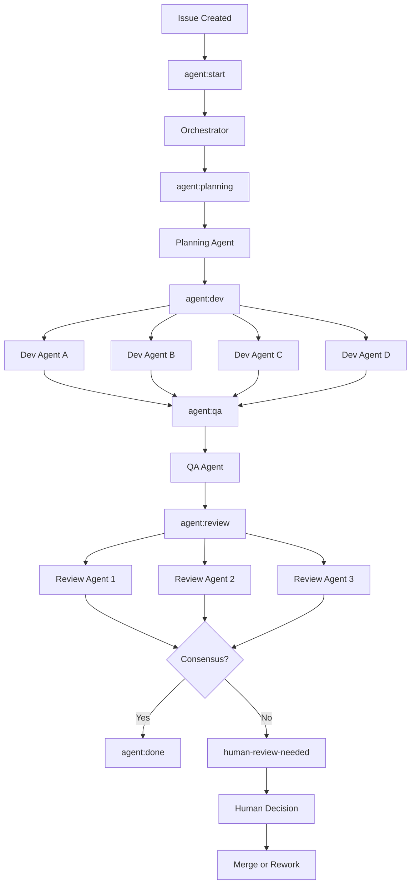

# Agent Roles & Handoff Map

## Role Overview

| Agent | Trigger Label | Output | Next Label |
|-------|--------------|--------|------------|
| Orchestrator | `agent:start` | Task breakdown comment | `agent:planning` |
| Planning Agent | `agent:planning` | Plan comment + branch | `agent:dev` |
| Dev Agent (A/B/C/D) | `agent:dev` | Code PR | `agent:qa` |
| QA Agent | `agent:qa` | Test report comment | `agent:review` |
| Review Agent (x3) | `agent:review` | Review comments | `agent:done` or `human-review-needed` |
| Schedule Agent | cron / manual | New issues from backlog | — |
| Slack Collector | cron | New issues from Slack | `agent:start` |

## Workflow Diagram

## Handoff Rules

1. **Label atomicity**: Only one agent label active at a time. Remove old label before adding new.
2. **Comment before label**: Agent must post a completion comment *before* updating the label.
3. **Branch naming**: `{agent}/{issue-number}-{slug}` e.g. `dev/42-add-auth`
4. **Sprint folder**: All work artifacts go in `sprints/{YYYY-MM-DD}/issue_{NNN}/`
5. **Escalation**: Any agent can add `escalated` label to pause pipeline and notify humans.

## Error Handling

- If an agent job fails (non-zero exit), GitHub Actions retries once automatically.
- After retry failure, `escalated` label is added and a comment is posted.
- Human must manually re-trigger by removing and re-adding the current stage label.
